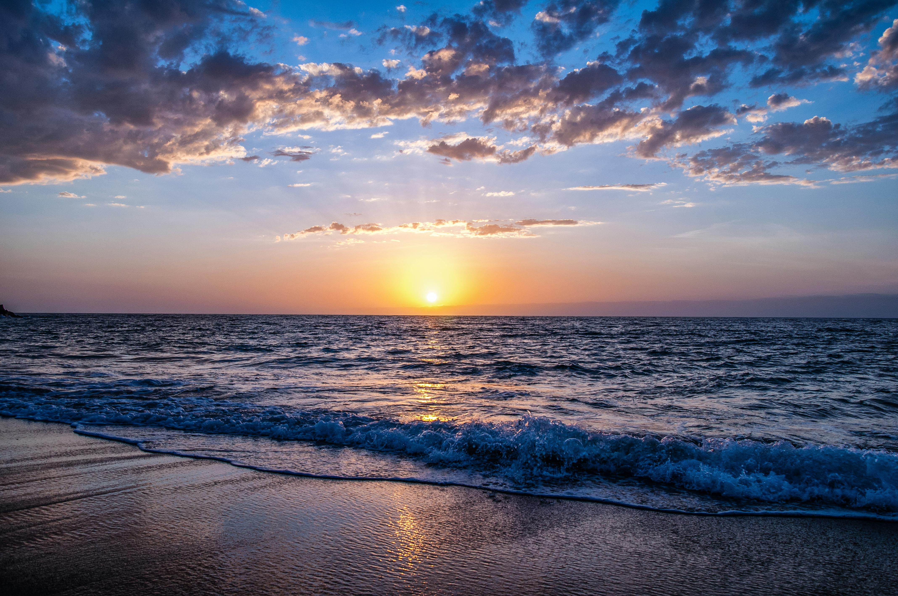

# Final Project

## Nevzat's GENCG Portfolio

### Final Project

In my final project I made a moving pixel sunset image. It was a hard and funny challenge for me. I have 3 iterations which shows my progress in this project perfectly.


### Iteration I: 
- I tried to build my environment with a blend of blue, purple, and pink. I didn’t get the result I hoped for, so I moved on to the sea, waves, and beach. It still wasn’t working as I imagined, but I learned a lot from the attempt.


<iframe src="content/day01/Project01/embed.html?v=2" width="100%" height="450" frameborder="no"></iframe>



### Iteration II: 
- Before the second iteration, I did some research and looked at example code on the p5.js website. Then I rebuilt the scene, since the first version wasn’t what I wanted. I used two simple colors a yellow/orange mix and blue for the sky, and created the sea with different blues. As a final touch I added a large sun in the middle and clouds. This felt like real progress.


<iframe src="content/day01/Project02/embed.html?v=2" width="100%" height="450" frameborder="no"></iframe>



### Iteration III: 
- The scene still felt a bit empty—just sea, sky, and sun so I added a beach and dolphins that swim and jump. I also gave the sea some random motion and added moving clouds to make the pixel scene feel more alive. Now the sunset with swimming dolphins feels much richer.


## REFERENCE IMAGE





<iframe src="content/day01/Project03/embed.html?v=2" width="100%" height="450" frameborder="no"></iframe>


```js
let cellSize = 12; // smaller cells = more detail
let cols, rows;
let t = 0;

function setup() {
  createCanvas(windowWidth, windowHeight);
  noStroke();
  recalcGrid();
}

function draw() {
  background(0);
  t += 0.01;

  // Horizon (sky/sea)
  let horizonY = height * 0.55;

  // Average shoreline position
  let baseShoreY = height * 0.78;

  // Sun (slight vertical motion)
  let sunX = width * 0.5;
  let sunY = height * 0.4 + sin(t * 0.7) * 20;
  let sunR = 90;

  // Clouds (horizontal drift)
  let cloud1x = (width * 0.2 + t * 80) % (width + 200) - 100;
  let cloud2x = (width * 0.7 + t * 50) % (width + 200) - 100;
  let cloud1y = height * 0.23;
  let cloud2y = height * 0.18;

  // --- DOLPHIN POSITIONS (only when jumping) ---
  let dolphins = [];
  for (let k = 0; k < 2; k++) {
    let cycle = 2.0;              // total cycle length
    let phaseOffset = k * 0.8;    // second dolphin slightly out of sync
    let local = (t * 0.8 + phaseOffset) % cycle;

    if (local < 0.7) {
      // jumping phase (~1/3 of the time)
      let jumpProgress = local / 0.7; // 0 → 1

      // horizontal path for each dolphin
      let startX = (k === 0) ? width * 0.25 : width * 0.55;
      let endX   = (k === 0) ? width * 0.45 : width * 0.80;
      let centerX = lerp(startX, endX, jumpProgress);

      // vertical arc above the water surface
      let baseY = horizonY - 10;   // just above horizon
      let heightArc = 70;
      let centerY = baseY - sin(jumpProgress * PI) * heightArc;

      dolphins.push({
        x: centerX,
        y: centerY,
        w: 60,   // biraz daha uzun gövde
        h: 24
      });
    }
  }

  // --- PEOPLE POSITIONS (on the beach, watching sunset) ---
  let manX = width * 0.68;
  let womanX = width * 0.73;
  let peopleY = baseShoreY + 20; // sitting height

  for (let j = 0; j < rows; j++) {
    for (let i = 0; i < cols; i++) {
      let x = i * cellSize;
      let y = j * cellSize;
      let cx = x + cellSize / 2;
      let cy = y + cellSize / 2;

      // Wavy shoreline (moves in and out)
      let shoreWave =
        sin(cx * 0.15 - t * 3) * 10 +  // horizontal wave
        sin(t * 1.2) * 5;              // breathing motion
      let shoreY = baseShoreY + shoreWave;

      let baseCol;

      // --- SKY / SEA / BEACH ---
      if (cy < horizonY) {
        // SKY
        let amt = cy / horizonY;
        let topColor = color(255, 140, 120);
        let bottomColor = color(80, 90, 200);
        baseCol = lerpColor(topColor, bottomColor, amt);
      } else if (cy < shoreY) {
        // SEA
        let amt = (cy - horizonY) / (shoreY - horizonY + 1);
        let topSea = color(20, 40, 130);
        let deepSea = color(5, 10, 45);
        baseCol = lerpColor(topSea, deepSea, amt);

        // Wave motion
        let wave = sin(cx * 0.08 + t * 3 + cy * 0.15);
        let waveBoost = map(wave, -1, 1, -15, 35);
        baseCol = brighten(baseCol, waveBoost);

        // Brighten near shore (soft glow)
        let distToShore = shoreY - cy;
        if (distToShore < 25) {
          let edgeBoost = map(distToShore, 25, 0, 0, 35);
          baseCol = brighten(baseCol, edgeBoost);
        }
      } else {
        // BEACH
        let amt = (cy - baseShoreY) / (height - baseShoreY);
        let drySand = color(230, 205, 150);
        let darkSand = color(180, 150, 110);
        baseCol = lerpColor(drySand, darkSand, amt);

        // Wet sand
        let distBelowShore = cy - shoreY;
        if (distBelowShore < 25) {
          let wetFactor = map(distBelowShore, 0, 25, 0.4, 0);
          let wetSand = color(200, 175, 140);
          baseCol = lerpColor(baseCol, wetSand, wetFactor);
        }

        // Sand texture (static noise – no flicker)
        let n = noise(cx * 0.12, cy * 0.12);
        let grain = map(n, 0, 1, -8, 8);
        baseCol = brighten(baseCol, grain);
      }

      // --- SUN (only in the sky) ---
      let dSun = dist(cx, cy, sunX, sunY);
      if (dSun < sunR && cy < horizonY) {
        let sunAmt = dSun / sunR;
        let inner = color(255, 250, 200);
        let outer = color(255, 150, 80);
        baseCol = lerpColor(inner, outer, sunAmt);
      }

      // --- CLOUDS ---
      if (
        cy < horizonY &&
        cx > cloud1x - 80 && cx < cloud1x + 80 &&
        cy > cloud1y - 25 && cy < cloud1y + 25
      ) {
        let cloudBase = color(255, 245, 245);
        baseCol = lerpColor(baseCol, cloudBase, 0.8);
      }

      if (
        cy < horizonY &&
        cx > cloud2x - 60 && cx < cloud2x + 60 &&
        cy > cloud2y - 20 && cy < cloud2y + 20
      ) {
        let cloudBase = color(255, 250, 250);
        baseCol = lerpColor(baseCol, cloudBase, 0.85);
      }

      // --- DOLPHIN SILHOUETTES ---
      let dolphinTop = color(25, 50, 90);
      let dolphinBelly = color(18, 35, 65);
      for (let dph of dolphins) {
        let part = dolphinPart(cx, cy, dph);
        if (part !== "none") {
          if (part === "top") baseCol = dolphinTop;
          else baseCol = dolphinBelly;
        }
      }

      // --- PEOPLE ON THE BEACH (couple watching the sunset) ---
      let peopleColor = color(40, 25, 35);
      if (cy > baseShoreY) {
        // Man
        if (isInPersonShape(cx, cy, manX, peopleY)) {
          baseCol = peopleColor;
        }
        // Woman
        if (isInPersonShape(cx, cy, womanX, peopleY)) {
          baseCol = peopleColor;
        }
      }

      fill(baseCol);
      rect(x, y, cellSize, cellSize);
    }
  }
}

// Which part of the dolphin is this pixel in? ("top", "belly", "none")
function dolphinPart(cx, cy, dph) {
  let relX = cx - dph.x;
  let relY = cy - dph.y;
  let bodyW = dph.w;
  let bodyH = dph.h;

  let inside = false;
  let isTop = false;

  // Main body ellipse
  let nx = relX / (bodyW * 0.6);
  let ny = relY / (bodyH * 0.55);
  if (nx * nx + ny * ny < 1.0) {
    inside = true;
    if (relY < 0) isTop = true;
  }

  // Head (front circle)
  let hx = (relX - bodyW * 0.15) / (bodyW * 0.35);
  let hy = relY / (bodyH * 0.5);
  if (hx * hx + hy * hy < 1.0) {
    inside = true;
    if (relY < 0) isTop = true;
  }

  // Dorsal fin (on top of body)
  if (
    relX > -bodyW * 0.1 &&
    relX < bodyW * 0.25 &&
    relY < -bodyH * 0.15 &&
    relY > -bodyH * 0.8
  ) {
    inside = true;
    isTop = true;
  }

  // Tail (back, small block)
  if (
    relX < -bodyW * 0.35 &&
    relX > -bodyW * 0.7 &&
    abs(relY) < bodyH * 0.5
  ) {
    inside = true;
    // tail mostly "belly" tone
  }

  // Cut off lower chunk to keep silhouette slim
  if (relY > bodyH * 0.7) inside = false;

  if (!inside) return "none";
  return isTop ? "top" : "belly";
}

// Simple sitting person shape made of blocks
function isInPersonShape(cx, cy, px, py) {
  let relX = cx - px;
  let relY = cy - py;

  let inside = false;

  // Torso
  if (relY > -30 && relY < -8 && abs(relX) < 8) inside = true;

  // Head
  if (relY > -40 && relY <= -30 && abs(relX) < 6) inside = true;

  // Legs extended forward
  if (relY >= -8 && relY < 6 && relX > -2 && relX < 14) inside = true;

  return inside;
}

// Safely brighten/darken a color
function brighten(col, amt) {
  let r = constrain(red(col) + amt, 0, 255);
  let g = constrain(green(col) + amt, 0, 255);
  let b = constrain(blue(col) + amt, 0, 255);
  return color(r, g, b);
}

function recalcGrid() {
  // Daha geniş görünüm için hücre boyutunu ekranla ölçekle
  cellSize = max(10, round(min(windowWidth, windowHeight) / 48));
  cols = ceil(windowWidth / cellSize);
  rows = ceil(windowHeight / cellSize);
}

function windowResized() {
  resizeCanvas(windowWidth, windowHeight);
  recalcGrid();
}
```

# Final Project


## Exploration & Experimentation
I built the pixel‑sunset in three iterations that match the visuals above. Iteration I (`Project01`) tests layout and palette with flat color bands, a sun, and blocky waves. Iteration II (`Project02`) switches to a grid: each cell blends sky/sea gradients and animates waves with sine motion; a soft cloud and larger sun add depth. Iteration III (`Project03`) adds story and motion—dolphins jump on arcs, the shoreline “breathes,” and two people sit on the beach watching the sunset.

## Influences & References
I followed the “pixels as material” idea and used my sunset reference image to guide palette and structure (sky–horizon–sea–beach). I also reviewed simple p5.js patterns (lerpColor, noise, sin) to keep the system readable while capturing the scene’s mood.

## Algorithmic Thinking
All sketches share a grid. Each cell decides whether it is sky, sea, or beach by comparing y to the horizon/shoreline. Colors come from vertical gradients; waves use `sin(x,t)`; cells near the shore are brightened. In Iteration III, dolphins are parametric shapes that move along timed arcs; the seated couple are small block silhouettes. The canvas and `cellSize` are responsive so the iframes fill their boxes, and a handful of parameters (cell size, speeds, colors) control variety with minimal code.

## Critical Reflection
Working directly with pixel cells made composition choices explicit. The hardest part was choosing a `cellSize` that feels crisp without noise. Evolving from flat bands to animated agents improved readability and interest without overcomplicating the rules. Next, I’d sample colors from the reference image and add seeding/saving to reproduce favorite frames.
