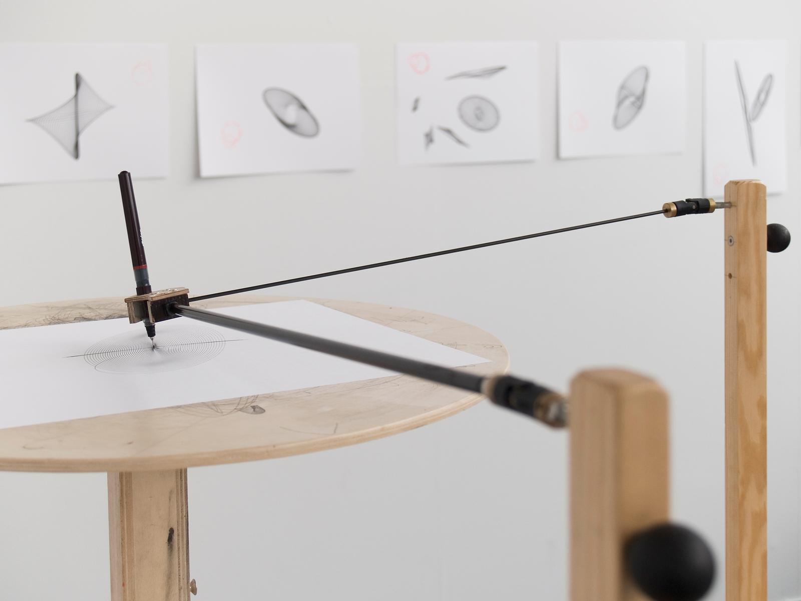
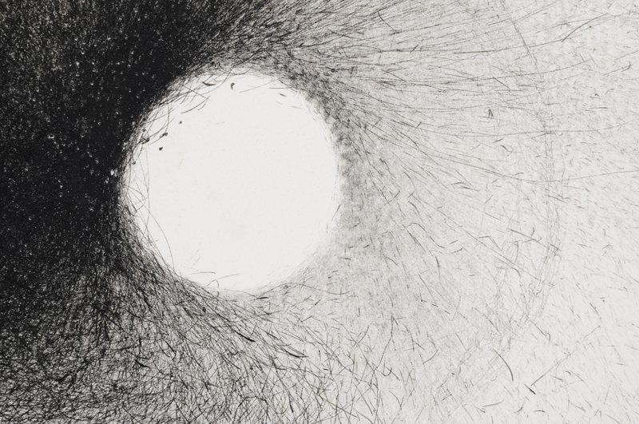

# Final Project

## Nevzat's GENCG Portfolio

### Final Project

In my final project I made a moving pixel sunset image. It was a hard and funny challenge for me.

### IMAGE01





<iframe src="content/day01/0401/embed.html" width="100%" height="450" frameborder="no"></iframe>


```js
// FAST DIGITAL HARMONOGRAPH — Drawing Machine
// Inspired by mechanical drawing arms and spirographs
// Press SPACE for a new pattern, S to save

let t = 0;
let arms = [];
let numArms = 3;
let trail = [];

function setup() {
  createCanvas(windowWidth, windowHeight);
  resetMachine();
  frameRate(120); // 🚀 faster drawing
}

function draw() {
  // fade background slightly for trailing effect
  background(245, 245, 240, 30);

  translate(width / 2, height / 2);
  stroke(20, 20, 20, 150);
  strokeWeight(1.8);
  noFill();

  let x = 0;
  let y = 0;

  // combine sinusoidal arms
  for (let i = 0; i < arms.length; i++) {
    let a = arms[i];
    x += sin(t * a.speed + a.phase) * a.length;
    y += cos(t * a.speed * a.dir + a.phase) * a.length;
  }

  // store trail (shorter for faster clearing)
  trail.push(createVector(x, y));
  if (trail.length > 1000) trail.shift();

  // draw the trail line
  beginShape();
  for (let v of trail) vertex(v.x, v.y);
  endShape();

  // draw the pen tip
  fill(0);
  noStroke();
  circle(x, y, 6);

  // ⏩ increase time faster
  t += 0.04;
}

function resetMachine() {
  background(245, 245, 240);
  arms = [];
  trail = [];
  for (let i = 0; i < numArms; i++) {
    arms.push({
      length: random(60, 200),
      speed: random(1.0, 3.5), // faster oscillation
      phase: random(TWO_PI),
      dir: random([1, -1])
    });
  }
  t = 0;
}

function keyPressed() {
  if (key === ' ') resetMachine();
  if (key === 'S' || key === 's') saveCanvas('drawing_machine', 'png');
}

```

### IMAGE02





<iframe src="content/day01/04.02/embed.html" width="100%" height="450" frameborder="no"></iframe>



# Week 4

## Exploration & Experimentation
FFor this week’s project, I explored how time and energy could be visualized as motion and light rather than as numeric information. I created two complementary visual systems: one based on dark, hand-drawn, ink-like strokes expanding from a circular void, and another inspired by Doctor Strange’s portal, a rotating ring of glowing energy lines that constantly shift and breathe. The first experiment expresses time as accumulation: every drawn stroke represents a passing moment that slowly builds density around an empty center. The second experiment treats time as flow, with luminous particles and rotating arcs that continuously circulate, fade, and re-emerge. Together, both systems capture time as transformation, something fluid, cyclic, and alive.

## Influences & References
Visually, the project was influenced by the mechanical precision of drawing machines and the cinematic aesthetics of Doctor Strange’s magical portals. The white-on-black drawings recall the physical traces of ink and charcoal, while the glowing orange portal reflects kinetic light installations and the idea of energy made visible. Conceptually, I was inspired by cyclical time and the idea of portals as thresholds between moments. Both drawings emphasize repetition, rhythm, and constant change, connecting natural cycles, motion, and perception.


## Algorithmic Thinking
Both visual systems were built through generative algorithms in p5.js. The white-on-black “charcoal clock” uses random vector directions and Perlin noise to generate hundreds of small strokes orbiting around an invisible core. Each stroke fades slightly, creating an evolving density pattern that never repeats exactly. The portal version relies on trigonometric motion, layered transparency, and additive color blending. Particles rotate along circular paths with slight phase offsets, producing glowing segments and sparks that simulate rotating energy. In both, time is mapped to motion speed and rotational phase, thus even without digits, the system behaves like a temporal organism that breathes, rotates, and regenerates over time.


## Critical Reflection
This project showed me that time can be communicated not only through structure but also through sensation. By shifting from measurable units to visual energy, I transformed the concept of a clock into a living, responsive environment. The contrast between the two experiments, the quiet, hand-drawn void and the intense, luminous portal, revealed how the same concept can evoke very different emotions depending on form and medium. Working with randomness and light decay taught me to find balance between control and unpredictability, enough order to remain readable yet enough chaos to feel organic. Ultimately, these drawings visualize time as motion, rhythm, and transformation, an endless cycle of creation and dissolution rather than a sequence of numbers.
