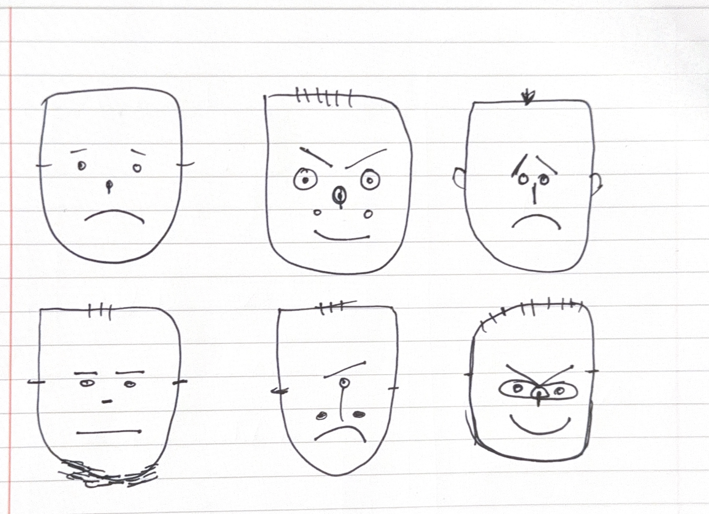

# Day#05 Faces / Parametric Generators

## Nevzat's GENCG Portfolio


In this project, I learned how to encode and draw multiple facial expressions. I first built a single face, then expanded it into a simple random generator that mixes several design variants to create many different faces.


### IMAGE01





<iframe src="content/day01/05/embed.html?v=1" width="100%" height="450" frameborder="no"></iframe>


```js
// Parametric Face Generator (simplified)
let faces = [];
const NUM_FACES = 12;

const buttonX = 20, buttonY = 20, buttonW = 200, buttonH = 40;
let hover = false;

function setup() {
  createCanvas(windowWidth, windowHeight);
  stroke(0); strokeWeight(2);
  textFont('sans-serif'); textSize(16);
  noFill(); noLoop();
  generateFaces();
}

function windowResized() {
  resizeCanvas(windowWidth, windowHeight);
  redraw();
}
function generateFaces() {
  faces = [];
  for (let i = 0; i < NUM_FACES; i++) faces.push(makeRandomFace());
}

function draw() {
  background(255);
  drawButton();

  const cols = 4, rows = 3, cellW = width / cols;
  const cellH = (height - 80) / rows, offsetY = 80;
  for (let i = 0; i < faces.length; i++) {
    const col = i % cols, row = floor(i / cols);
    const x = cellW * col + cellW / 2;
    const y = offsetY + cellH * row + cellH / 2;
    drawFace(x, y, faces[i]);
  }
}

function drawButton() {
  fill(hover ? 230 : 245); stroke(0);
  rect(buttonX, buttonY, buttonW, buttonH, 8);
  fill(0); noStroke(); textAlign(CENTER, CENTER);
  text("Generate New Faces", buttonX + buttonW / 2, buttonY + buttonH / 2);
  noFill(); stroke(0);
}

function mouseMoved() {
  hover = mouseX > buttonX && mouseX < buttonX + buttonW && mouseY > buttonY && mouseY < buttonY + buttonH;
  redraw();
}

function mousePressed() {
  if (hover) { generateFaces(); redraw(); }
}

function makeRandomFace() {
  const p = {
    headWidth: random(120, 200),
    headHeight: random(140, 220),
    eyeSize: random(10, 30),
    eyeSpacing: random(30, 80),
    eyeOffsetY: random(-20, 10),
    mouthWidth: random(40, 100),
    mouthCurvature: random(-25, 25),
    browTilt: random(-15, 15),
    numEyes: random([1, 2, 3]),
    hasBlush: random() < 0.5,
    hasHair: random() < 0.5,
    eyeShape: random(["round", "oval"])
  };
  p.mood = map(p.mouthCurvature, -25, 25, -1, 1);
  return p;
}

function drawFace(cx, cy, p) {
  push(); translate(cx, cy); noFill(); stroke(0);

  beginShape();
  curveVertex(-p.headWidth/2, -p.headHeight/2);
  curveVertex(-p.headWidth/2, -p.headHeight/2);
  curveVertex(0, -p.headHeight/2 - 10);
  curveVertex(p.headWidth/2, -p.headHeight/2);
  curveVertex(p.headWidth/2 + 10, p.headHeight/4);
  curveVertex(0, p.headHeight/2 + 10);
  curveVertex(-p.headWidth/2 - 10, p.headHeight/4);
  curveVertex(-p.headWidth/2, -p.headHeight/2);
  curveVertex(-p.headWidth/2, -p.headHeight/2);
  endShape();

  line(-p.headWidth/2, 0, -p.headWidth/2 - 20, 0);
  line(p.headWidth/2, 0, p.headWidth/2 + 20, 0);

  if (p.hasHair) for (let x = -20; x <= 20; x += 10) line(x, -p.headHeight/2 - 5, x, -p.headHeight/2 - random(15, 25));

  const y0 = p.eyeOffsetY;
  if (p.numEyes === 1) drawEye(0, y0, p);
  if (p.numEyes === 2) { drawEye(-p.eyeSpacing/2, y0, p); drawEye(p.eyeSpacing/2, y0, p); }
  if (p.numEyes === 3) { drawEye(-p.eyeSpacing/1.5, y0, p); drawEye(0, y0 + 5, p); drawEye(p.eyeSpacing/1.5, y0, p); }

  const browY = y0 - 25, tilt = p.browTilt + p.mood * 10;
  if (p.numEyes >= 2) {
    line(-p.eyeSpacing/2 - 10, browY - tilt, -p.eyeSpacing/2 + 10, browY + tilt);
    line(p.eyeSpacing/2 - 10, browY + tilt, p.eyeSpacing/2 + 10, browY - tilt);
  } else {
    line(-20, browY + tilt, 20, browY - tilt);
  }

  const noseLen = map(p.mood, -1, 1, 35, 15);
  line(0, y0, 0, y0 + noseLen);

  const mouthY = y0 + 50, w = p.mouthWidth, c = p.mouthCurvature;
  beginShape(); vertex(-w/2, mouthY); quadraticVertex(0, mouthY + c, w/2, mouthY); endShape();

  if (p.hasBlush) {
    noStroke(); fill(255, 150, 180, 120);
    ellipse(-p.eyeSpacing/2, y0 + 30, 18, 12);
    ellipse(p.eyeSpacing/2, y0 + 30, 18, 12);
    noFill(); stroke(0);
  }
  pop();
}

function drawEye(x, y, p) {
  push(); translate(x, y);
  if (p.eyeShape === "round") ellipse(0, 0, p.eyeSize, p.eyeSize);
  else ellipse(0, 0, p.eyeSize*1.4, p.eyeSize*0.8);
  fill(0); ellipse(0, 0, p.eyeSize/3, p.eyeSize/3); noFill();
  pop();
}

```

# Week 5

## Exploration & Experimentation
At first, it took me a while to figure out how to draw the faces. After a few experiments—and with some help from ChatGPT—the process became clearer. I began by sketching the designs on paper and then translated them into code. I built a single face template and layered multiple expressions on top of it, turning it into a small random generator. It was both enjoyable and surprisingly challenging.

## Influences & References
As references, I used the visuals from Lesson 6. Those examples helped me understand how to structure the facial features and guided the overall look of the generator, especially in balancing variation across expressions while keeping a simple, readable style.

## Algorithmic Thinking
I treat each face as a set of parameters instead of a fixed drawing. Sizes and positions (head, eyes, mouth, brows) are picked randomly within safe ranges, and a few switches control style (eye count/shape, hair, blush). A single “mood” value comes from mouth curvature and also tilts the eyebrows and changes nose length, so features move together. The 4×3 grid comes from the canvas size, and the button simply regenerates new parameters. With these simple rules, the code stays readable but produces many different faces.

## Critical Reflection
Designing faces with parameters taught me to balance randomness and control. Keeping ranges small and sharing a “mood” value across features made expressions feel consistent but still varied. The hardest part was deciding what to randomize versus keep fixed. Next, I’d add saved seeds and simple color palettes to curate results even better.

