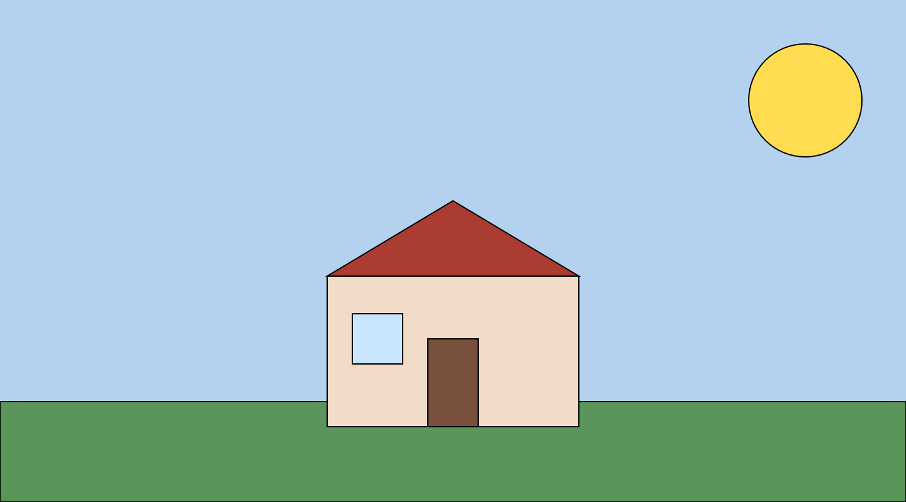

# Nevzat's GENCG Portfolio

## Day#01 Learning the basics

### Sollewit: Wall drawing

In this project, I created a simple house scene using p5.js. I used basic shapes like rectangles, triangles, and circles to draw the background, house, roof, door, window, and sun. The fill() function allowed me to set different colors for each part of the drawing. This project helped me understand how simple geometric shapes can be combined to form meaningful objects in a digital scene.




```js
// Javascript code with syntax highlighting.
function setup() {
  createCanvas(720, 400);
  background(180, 210, 240);

  fill(90, 150, 90);
  rect(0, 320, width, 80);

  fill(255, 220, 80);
  circle(640, 80, 90);

  fill(240, 220, 200);
  rect(260, 220, 200, 120);

  fill(170, 60, 50);
  triangle(260, 220, 460, 220, 360, 160);

  fill(120, 80, 60);
  rect(340, 270, 40, 70);

  fill(200, 230, 255);
  rect(280, 250, 40, 40);
}
```
# Week 01 – Simple House Scene

## Exploration & Experimentation
This week, I experimented with p5.js by trying to build a small and simple house scene from basic shapes.  
I used rectangles, triangles, and circles to represent elements like the house, roof, door, window, ground, and sun.  
While coding, I tested different colors to find a calm and balanced composition between the sky and the ground.  
It was mostly a process of trial and error, learning how each shape and coordinate affects the final output.

## Influences & References
I didn’t follow or reference any specific artist or artwork for this project.  
Instead, I focused on experimenting and discovering what I could create just by trying different shapes and colors on my own.  
The goal was to learn through doing and understand how simple elements can form a complete visual scene.

## Algorithmic Thinking
The logic behind my sketch was straightforward:  
- Create a light blue background for the sky.  
- Add a green rectangle for the ground.  
- Place a large yellow circle in the upper right corner for the sun.  
- Use a beige rectangle as the house base and a red triangle as the roof.  
- Add a brown rectangle as the door and a light blue square as the window.  
Each element has fixed positions and sizes, which helped me learn about coordinates and layering in p5.js.

## Critical Reflection
The result turned out clear and visually balanced, even though it was made with very simple shapes.  
I’m happy that I managed to understand how to position and color different elements correctly.  
Next time, I want to explore adding more details or animations, such as clouds, shadows, or small movement in the sun.  
This project helped me realize that even with minimal code, it’s possible to create a meaningful and visually complete scene.

### Webcam tests

Lorem ipsum dolor sit amet, consetetur sadipscing elitr, sed diam nonumy eirmod tempor invidunt ut labore et dolore magna aliquyam erat, sed diam voluptua. At vero eos et accusam et justo duo dolores et ea rebum. Stet clita kasd gubergren, no sea takimata sanctus est Lorem ipsum dolor sit amet. Lorem ipsum dolor sit amet, consetetur sadipscing elitr, sed diam nonumy eirmod tempor invidunt ut labore et dolore magna aliquyam erat, sed diam voluptua.


<iframe src="content/day01/01/embed.html" width="100%" height="450" frameborder="no"></iframe>


Lorem ipsum dolor sit amet, consetetur sadipscing elitr, sed diam nonumy eirmod tempor invidunt ut labore et dolore magna aliquyam erat, sed diam voluptua. At vero eos et accusam et justo duo dolores et ea rebum. Stet clita kasd gubergren, no sea takimata sanctus est Lorem ipsum dolor sit amet. Lorem ipsum dolor sit amet, consetetur sadipscing elitr, sed diam nonumy eirmod tempor invidunt ut labore et dolore magna aliquyam erat, sed diam voluptua.


<iframe src="content/day01/02/embed.html" width="100%" height="450" frameborder="no"></iframe>


## Computing with computer

Lorem ipsum dolor sit amet, consetetur sadipscing elitr, sed diam nonumy eirmod tempor invidunt ut labore et dolore magna aliquyam erat, sed diam voluptua. At vero eos et accusam et justo duo dolores et ea rebum. Stet clita kasd gubergren, no sea takimata sanctus est Lorem ipsum dolor sit amet. Lorem ipsum dolor sit amet, consetetur sadipscing elitr, sed diam nonumy eirmod tempor invidunt ut labore et dolore magna aliquyam erat, sed diam voluptua.

> At vero eos et accusam et justo duo dolores et ea rebum. Stet clita kasd gubergren, no sea takimata sanctus est Lorem ipsum dolor sit amet. Lorem ipsum dolor sit amet, consetetur sadipscing elitr, sed diam nonumy eirmod tempor invidunt ut labore et dolore magna aliquyam erat, sed diam voluptua.


<iframe src="content/day01/03/embed.html" width="100%" height="450" frameborder="no"></iframe>


* Lorem ipsum dolor sit amet
* Consetetur sadipscing elitr, sed diam nonumy.
* At vero eos et accusam et justo duo dolores et ea rebum. 
